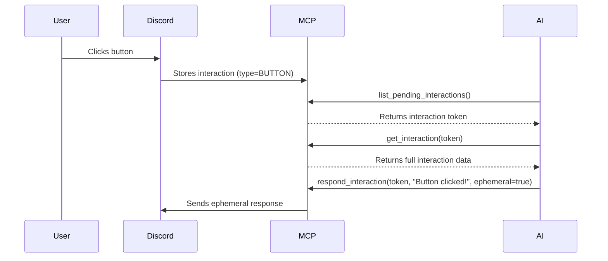
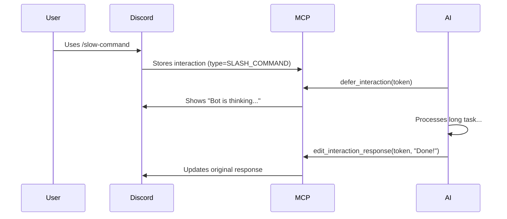
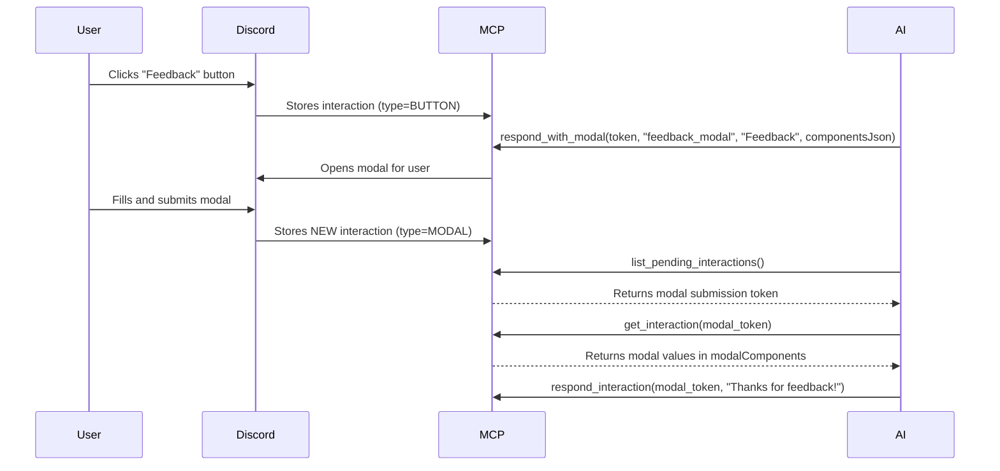

# Discord MCP - Interaction Tools Documentation

This document describes the MCP tools for handling Discord interactions (slash commands, buttons, select menus, modals).

## Overview

The InteractionService captures incoming Discord interactions and makes them available for MCP clients to poll and respond to. Each interaction is stored with its token, allowing delayed responses (up to 15 minutes per Discord limits).

## Tools

### 1. `list_pending_interactions`

List all pending Discord interactions waiting for response.

**Parameters:**
- `limit` (optional, string): Maximum number to return (default: 50)

**Returns:** Formatted list of pending interactions with ID, type, user, customId, command, component, and timestamp.

**Example:**
```json
{
  "name": "list_pending_interactions",
  "arguments": {"limit": "20"}
}
```

---

### 2. `get_interaction`

Get full details of a specific pending interaction by token.

**Parameters:**
- `token` (required, string): Interaction token from `list_pending_interactions`

**Returns:** Complete JSON object with all interaction data including:
- `id`, `token`, `type`
- `guildId`, `channelId`, `userId`, `username`
- `timestamp`
- `customId` (for modals/components)
- `commandName` (for slash commands)
- `componentId`, `buttonId`, `componentType`
- `selectedValues` (for select menus)
- `modalComponents` (for modals - list of text inputs with values)
- `commandOptions` (for slash commands - list of options with values)

**Example:**
```json
{
  "name": "get_interaction",
  "arguments": {"token": "aW50ZXJhY3Rpb246MTIz..."}
}
```

---

### 3. `respond_interaction`

Respond to a pending interaction with a message (initial response). Use this for immediate responses.

**Parameters:**
- `token` (required, string): Interaction token
- `content` (required, string): Response message content
- `embedsJson` (optional, string): JSON array of embed objects
- `componentsJson` (optional, string): JSON array of action rows with buttons/selects
- `ephemeral` (optional, string): "true" or "false" - whether response is ephemeral (only visible to user)

**Returns:** Success message or error.

**Example:**
```json
{
  "name": "respond_interaction",
  "arguments": {
    "token": "aW50ZXJhY3Rpb246MTIz...",
    "content": "Hello! Button clicked.",
    "ephemeral": "true"
  }
}
```

---

### 4. `defer_interaction`

Defer an interaction response (acknowledge without sending content yet). Use this when you need time to process (e.g., long-running task). After deferring, use `edit_interaction_response` or `followup_interaction`.

**Parameters:**
- `token` (required, string): Interaction token
- `ephemeral` (optional, string): "true" or "false" - whether response is ephemeral

**Returns:** Success message or error.

**Example:**
```json
{
  "name": "defer_interaction",
  "arguments": {
    "token": "aW50ZXJhY3Rpb246MTIz...",
    "ephemeral": "false"
  }
}
```

---

### 5. `edit_interaction_response`

Edit the original interaction response message (after defer or initial respond).

**Parameters:**
- `token` (required, string): Interaction token
- `content` (required, string): New message content
- `embedsJson` (optional, string): JSON array of embed objects
- `componentsJson` (optional, string): JSON array of action rows with buttons/selects

**Returns:** Success message or error.

**Example:**
```json
{
  "name": "edit_interaction_response",
  "arguments": {
    "token": "aW50ZXJhY3Rpb246MTIz...",
    "content": "Updated response content"
  }
}
```

---

### 6. `followup_interaction`

Send a followup message to an interaction (after defer). Can be used multiple times.

**Parameters:**
- `token` (required, string): Interaction token
- `content` (required, string): Message content
- `embedsJson` (optional, string): JSON array of embed objects
- `componentsJson` (optional, string): JSON array of action rows with buttons/selects
- `ephemeral` (optional, string): "true" or "false" - whether followup is ephemeral

**Returns:** Success message or error.

**Example:**
```json
{
  "name": "followup_interaction",
  "arguments": {
    "token": "aW50ZXJhY3Rpb246MTIz...",
    "content": "Followup message #1",
    "ephemeral": "false"
  }
}
```

---

### 7. `delete_interaction_response`

Delete the original interaction response message.

**Parameters:**
- `token` (required, string): Interaction token

**Returns:** Success message or error.

**Example:**
```json
{
  "name": "delete_interaction_response",
  "arguments": {"token": "aW50ZXJhY3Rpb246MTIz..."}
}
```

---

### 8. `respond_with_modal`

Respond to a component interaction (button/select) or slash command by opening a modal.

**Parameters:**
- `token` (required, string): Interaction token
- `customId` (required, string): Modal custom ID
- `title` (required, string): Modal title
- `componentsJson` (optional, string): JSON array of ActionRow components with TextInputs

**Returns:** Success message or error.

**Example:**
```json
{
  "name": "respond_with_modal",
  "arguments": {
    "token": "aW50ZXJhY3Rpb246MTIz...",
    "customId": "feedback_modal",
    "title": "Feedback Form",
    "componentsJson": "[{\"type\":1,\"components\":[{\"type\":4,\"custom_id\":\"feedback_text\",\"label\":\"Your Feedback\",\"style\":2,\"required\":true}]}]"
  }
}
```

---

## Interaction Types

| Type | Description | Triggered By |
|------|-------------|--------------|
| `BUTTON` | Button click | User clicks a button |
| `SELECT_MENU` | String select menu | User selects from dropdown |
| `MODAL` | Modal submit | User submits a modal |
| `SLASH_COMMAND` | Slash command | User uses /command |
| `COMPONENT` | Other components | Entity select, user select, role select |

---

## JSON Schemas

### Embed Object
```json
{
  "title": "Embed Title",
  "description": "Embed description",
  "url": "https://example.com",
  "color": 16711680,
  "fields": [
    {"name": "Field 1", "value": "Value 1", "inline": true},
    {"name": "Field 2", "value": "Value 2", "inline": false}
  ],
  "footer": {"text": "Footer text", "icon_url": "https://..."},
  "image": {"url": "https://..."},
  "thumbnail": {"url": "https://..."},
  "author": {"name": "Author", "url": "https://...", "icon_url": "https://..."}
}
```

### ActionRow with Button
```json
{
  "type": 1,
  "components": [
    {
      "type": 2,
      "style": 1,
      "label": "Click Me",
      "custom_id": "my_button",
      "disabled": false,
      "emoji": {"name": "👍"}
    }
  ]
}
```

### ActionRow with String Select
```json
{
  "type": 1,
  "components": [
    {
      "type": 3,
      "custom_id": "my_select",
      "placeholder": "Choose an option",
      "min_values": 1,
      "max_values": 1,
      "options": [
        {"label": "Option 1", "value": "opt1", "description": "First option"},
        {"label": "Option 2", "value": "opt2", "description": "Second option"}
      ]
    }
  ]
}
```

### Modal Components (TextInput)
```json
[
  {
    "type": 1,
    "components": [
      {
        "type": 4,
        "custom_id": "text_input_id",
        "label": "Label",
        "style": 1,
        "min_length": 1,
        "max_length": 4000,
        "required": true,
        "placeholder": "Enter text...",
        "value": "Default value"
      }
    ]
  }
]
```

**TextInput Styles:**
- `1` = SHORT (single line)
- `2` = PARAGRAPH (multi-line)

---

## Workflow Examples

### Simple Button Response


### Deferred Response (Long Processing)


### Modal Flow


---

## Important Notes

1. **Interaction Tokens Expire**: Discord interaction tokens are valid for 15 minutes. After responding, the interaction is removed from the pending list.

2. **Ephemeral Responses**: Only the user who triggered the interaction can see ephemeral messages. Use for private feedback, error messages, etc.

3. **Component IDs**: Buttons and select menus need unique `custom_id` values. These are returned in `componentId` and `customId` fields.

4. **Modal Values**: When a modal is submitted, the values are in `modalComponents` array with `custom_id` and `value` fields.

5. **Concurrency**: Multiple interactions can be pending simultaneously. Use tokens to target specific ones.

6. **Error Handling**: All tools return error messages as strings. Check for "Error:" prefix in responses.

---

## MCP Schema Registration

The tools are automatically registered via Spring AI's `@Tool` annotations. Hermes will discover them at startup and expose them via the MCP protocol with proper JSON schemas derived from the `@ToolParam` descriptions.

To verify tools are registered:
```bash
# Check MCP server capabilities
# Tools will appear in the tools/list response
```